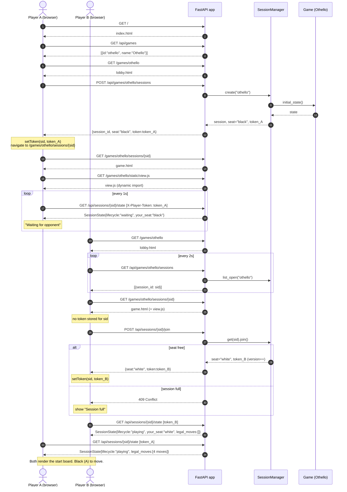

# Sequence — Browse, Create & Join a Session

Player A creates a game from the lobby. Player B sees it in the lobby and
joins. Both game pages then poll until the session is `playing`.

```mermaid
sequenceDiagram
    autonumber
    actor A as Player A (browser)
    actor B as Player B (browser)
    participant S as FastAPI app
    participant SM as SessionManager
    participant G as Game (Othello)

    A->>S: GET /
    S-->>A: index.html
    A->>S: GET /api/games
    S-->>A: [{id:"othello", name:"Othello"}]
    A->>S: GET /games/othello
    S-->>A: lobby.html

    A->>S: POST /api/games/othello/sessions
    S->>SM: create("othello")
    SM->>G: initial_state()
    G-->>SM: state
    SM-->>S: session, seat="black", token_A
    S-->>A: {session_id, seat:"black", token:token_A}
    Note over A: setToken(sid, token_A)<br/>navigate to /games/othello/sessions/{sid}

    A->>S: GET /games/othello/sessions/{sid}
    S-->>A: game.html
    A->>S: GET /games/othello/static/view.js
    S-->>A: view.js (dynamic import)

    loop every 1s
        A->>S: GET /api/sessions/{sid}/state [X-Player-Token: token_A]
        S-->>A: SessionState{lifecycle:"waiting", your_seat:"black"}
        Note over A: "Waiting for opponent"
    end

    B->>S: GET /games/othello
    S-->>B: lobby.html
    loop every 2s
        B->>S: GET /api/games/othello/sessions
        S->>SM: list_open("othello")
        S-->>B: [{session_id: sid}]
    end

    B->>S: GET /games/othello/sessions/{sid}
    S-->>B: game.html (+ view.js)
    Note over B: no token stored for sid
    B->>S: POST /api/sessions/{sid}/join
    S->>SM: get(sid).join()
    alt seat free
        SM-->>S: seat="white", token_B (version++)
        S-->>B: {seat:"white", token:token_B}
        Note over B: setToken(sid, token_B)
    else session full
        S-->>B: 409 Conflict
        Note over B: show "Session full"
    end

    B->>S: GET /api/sessions/{sid}/state [token_B]
    S-->>B: SessionState{lifecycle:"playing", your_seat:"white", legal_moves:[]}
    A->>S: GET /api/sessions/{sid}/state [token_A]
    S-->>A: SessionState{lifecycle:"playing", legal_moves:[4 moves]}
    Note over A,B: Both render the start board. Black (A) to move.
```
