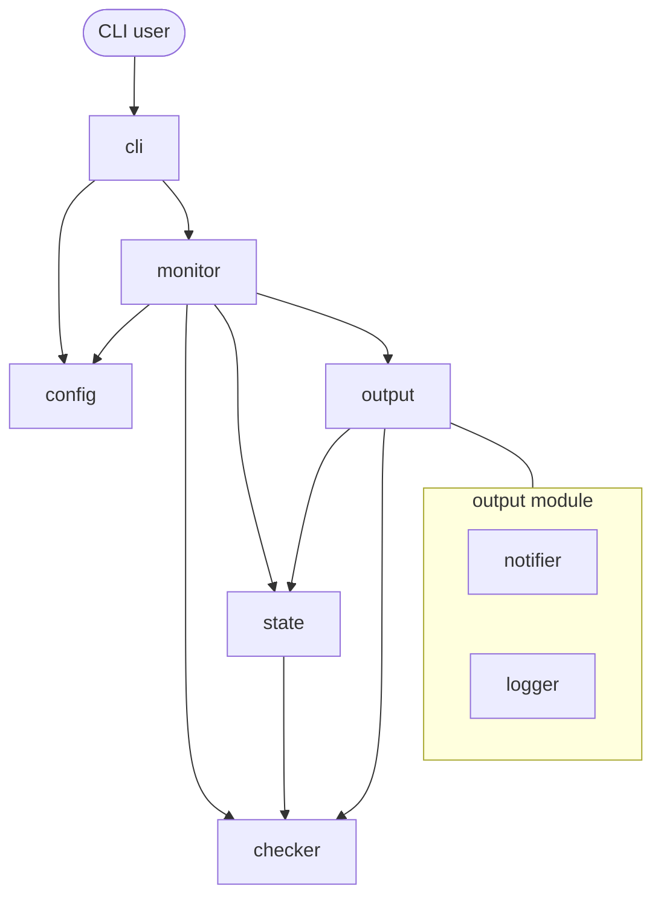
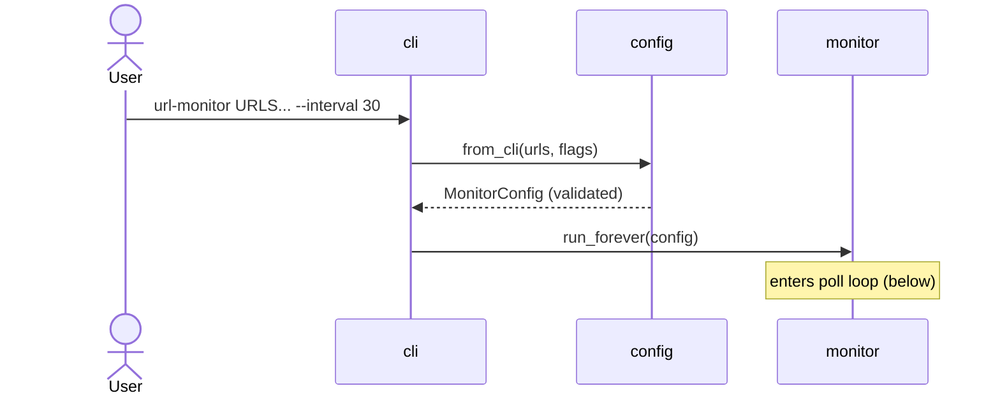
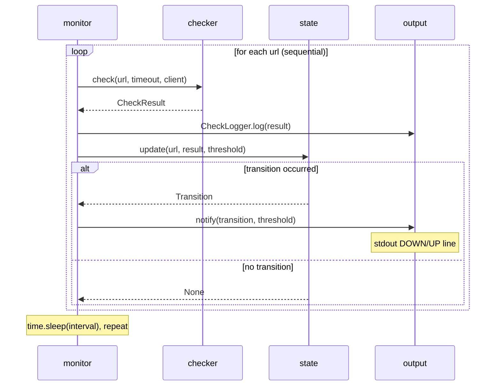
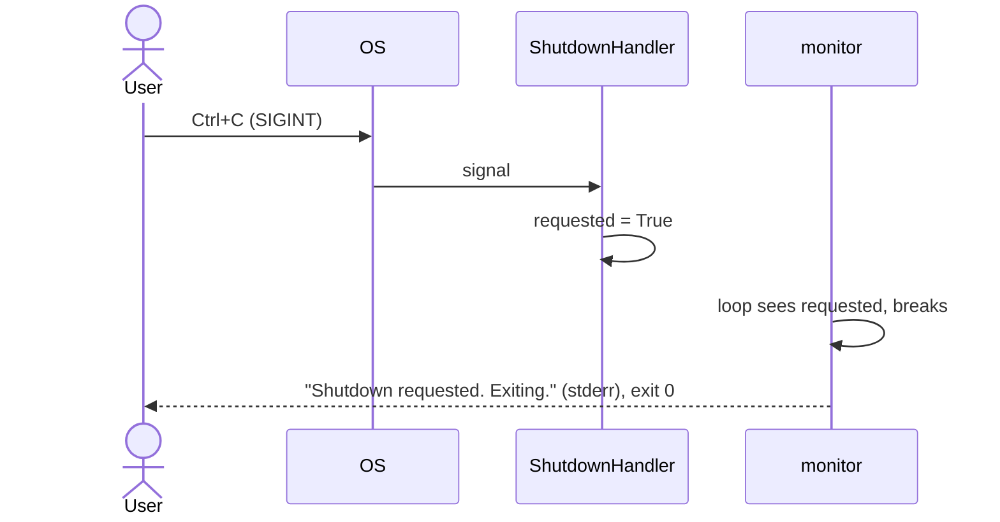

# Module Decomposition: URL Monitor CLI

## Overview

The URL Monitor CLI is a pure-Python foreground uptime monitor: it validates
CLI input, checks URLs over HTTP on a schedule, tracks per-URL UP/DOWN state,
notifies on transitions, and logs every check. The system is decomposed into
six modules along its data-flow pipeline (`input → check → decide → emit → orchestrate`),
grouping the two output sinks (`notifier` + `logger`) into a single `output`
module by technology affinity. Each module is a self-contained package inside
`src/url_monitor/` with its own test file, communicating exclusively through
plain function calls and frozen dataclasses.

## Modules

### Module: config

- **Responsibility:** Own the single source of truth for runtime configuration and validate all user-supplied settings at startup.
- **Key capabilities:**
  - `MonitorConfig` Pydantic `BaseSettings` model (`urls`, `failure_threshold`, `interval`, `timeout`, `log_file`).
  - `from_cli(...)` factory that merges parsed CLI args into a validated model.
  - Field validation (non-empty URLs, positive thresholds/intervals/timeouts) that fails fast.
- **Tech stack / technology affinity:** `pydantic`, `pydantic-settings`.
- **Build & deploy:** Ships as `config.py` inside the `url_monitor` wheel; imports nothing from other app modules, so it builds and tests in isolation.
- **Test strategy:** Unit tests instantiating `MonitorConfig` / `from_cli` with valid and invalid inputs; assert `ValidationError` on bad values. No network, no I/O.

#### Public API

```python
class MonitorConfig(BaseSettings):
    urls: list[str]            # min_length=1
    failure_threshold: int     # default 3, ge=1
    interval: int              # default 30, ge=1 (seconds)
    timeout: int               # default 10, ge=1 (seconds)
    log_file: str | None       # default None

def from_cli(
    urls: tuple[str, ...],
    failure_threshold: int,
    interval: int,
    timeout: int,
    log_file: str | None,
) -> MonitorConfig: ...
```

Contract style: in-process function calls; returns a validated immutable-by-convention settings object. Raises `pydantic.ValidationError` on invalid input.

#### Dependencies

- **Consumes:** none (leaf module).
- **Consumed by:** `cli`, `monitor`.

---

### Module: checker

- **Responsibility:** Perform a single HTTP health check for one URL and classify success/failure.
- **Key capabilities:**
  - `check()` — synchronous `httpx.Client` GET with `follow_redirects=True`, timing, and error capture.
  - Failure classification: HTTP status ≥ 400 or any `httpx.RequestError` (connection/timeout/DNS/SSL).
  - `CheckResult` frozen dataclass — the canonical result value object for the whole pipeline.
  - `is_failure()` — single predicate encapsulating the failure rule.
- **Tech stack / technology affinity:** `httpx` (sync `Client`), `datetime`, `dataclasses`.
- **Build & deploy:** `checker.py`; depends only on stdlib + `httpx`. Independently importable.
- **Test strategy:** Unit tests with `httpx.MockTransport` injected via the optional `client` parameter — 200/404/503/redirect/connection-error cases. No live network.

#### Public API

```python
@dataclass(frozen=True)
class CheckResult:
    url: str
    success: bool
    status_code: int | None
    response_time_ms: float | None
    error: str | None
    timestamp: datetime

def check(url: str, timeout: int, client: httpx.Client | None = None) -> CheckResult: ...
def is_failure(result: CheckResult) -> bool: ...
```

Contract style: in-process function calls returning a `CheckResult`. Accepts an optional injected `httpx.Client` so callers can reuse a connection and tests can mock transport.

#### Dependencies

- **Consumes:** none (leaf module).
- **Consumed by:** `state` (imports `CheckResult`, `is_failure`), `output`, `monitor`.

---

### Module: state

- **Responsibility:** Own the per-URL state machine and decide when a status transition (UP/DOWN) has occurred.
- **Key capabilities:**
  - `UrlStatus` enum (`UNKNOWN`/`UP`/`DOWN`), `UrlState`, and `Transition` value objects.
  - `StateTracker` — in-memory dict of per-URL state; increments/resets `consecutive_failures`.
  - Transition rules: `UP→DOWN` and `UNKNOWN→DOWN` at threshold, `DOWN→UP` on first success, `UNKNOWN→UP` silent.
- **Tech stack / technology affinity:** pure Python (`dataclasses`, `enum`); consumes `CheckResult` from `checker`.
- **Build & deploy:** `state.py`; no I/O, no network — pure logic. Independently testable.
- **Test strategy:** Deterministic unit tests feeding `CheckResult` fixture sequences and asserting the exact transition (or `None`) and counter behavior.

#### Public API

```python
class UrlStatus(str, Enum): UNKNOWN; UP; DOWN

@dataclass
class UrlState:
    status: UrlStatus = UrlStatus.UNKNOWN
    consecutive_failures: int = 0

@dataclass(frozen=True)
class Transition:
    url: str
    from_status: UrlStatus
    to_status: UrlStatus
    result: CheckResult

class StateTracker:
    def get(self, url: str) -> UrlState: ...
    def update(self, url: str, result: CheckResult, threshold: int) -> Transition | None: ...
```

Contract style: in-process function calls. `update()` returns a `Transition` only on a notifiable state change, otherwise `None`.

#### Dependencies

- **Consumes:** `checker` (`CheckResult`, `is_failure`).
- **Consumed by:** `output` (imports `Transition`, `UrlStatus`), `monitor`.

---

### Module: output

- **Responsibility:** Render pipeline events to their correct channels, enforcing the stdout-vs-stderr-vs-file separation. Combines the `notifier` (stdout transitions) and `logger` (routine check log) sinks, grouped by technology affinity — both are pure formatters that serialize domain objects to text streams.
- **Key capabilities:**
  - `notifier.format_notification()` / `notify()` — human-readable DOWN/UP lines to **stdout** on transitions only.
  - `logger.format_check_log()` / `CheckLogger` — every check appended to a **log file** (if `--log-file`) or written to **stderr**.
- **Tech stack / technology affinity:** pure Python (`sys`, `pathlib`); consumes `Transition` (from `state`) and `CheckResult` (from `checker`). No third-party deps.
- **Build & deploy:** `notifier.py` + `logger.py`; no network. Deployable/testable as a pair.
- **Test strategy:** Unit tests asserting exact formatted strings and channel routing — `capsys` for stdout/stderr, `tmp_path` for append-only file writes.

#### Public API

```python
# notifier.py  (stdout — transitions only)
def format_notification(transition: Transition, threshold: int) -> str: ...
def notify(transition: Transition, threshold: int) -> None: ...

# logger.py  (log file or stderr — every check)
def format_check_log(result: CheckResult) -> str: ...
class CheckLogger:
    def __init__(self, log_file: str | None) -> None: ...
    def log(self, result: CheckResult) -> None: ...
```

Contract style: in-process function calls with side effects on `sys.stdout` / `sys.stderr` / the log file. **Channel invariant:** routine results never go to stdout; transition notifications never go to the routine log.

#### Dependencies

- **Consumes:** `state` (`Transition`, `UrlStatus`), `checker` (`CheckResult`).
- **Consumed by:** `monitor`.

---

### Module: monitor

- **Responsibility:** Orchestrate the pipeline — drive the sequential check round, the continuous poll loop, and graceful shutdown.
- **Key capabilities:**
  - `run_round()` — one sequential pass over all URLs: `check → state.update → log → notify`.
  - `run_forever()` — poll loop with `time.sleep(interval)`, startup/shutdown messages.
  - `ShutdownHandler` — installs SIGINT/SIGTERM handlers, sets a shutdown flag for a clean exit.
  - Owns the shared `httpx.Client` lifecycle for connection reuse.
- **Tech stack / technology affinity:** `signal`, `time`, `httpx.Client` lifecycle; wires `checker` + `state` + `output` + `config`.
- **Build & deploy:** `monitor.py`; runtime-depends on the four modules above. Builds independently (imports resolve at package build).
- **Test strategy:** Integration tests with `check` patched / `MockTransport` and `time.sleep` patched (or shutdown flag pre-set) so the loop never hangs; assert transition output and check counts.

#### Public API

```python
def run_round(config: MonitorConfig, tracker: StateTracker, client: httpx.Client) -> list[Transition]: ...
def run_forever(config: MonitorConfig) -> None: ...

class ShutdownHandler:
    requested: bool
    def install(self) -> None: ...
```

Contract style: in-process function calls. `run_forever(config)` is the production entry invoked by `cli`; runs until a signal sets the shutdown flag, then returns for exit code 0.

#### Dependencies

- **Consumes:** `config` (`MonitorConfig`), `checker` (`check`), `state` (`StateTracker`, `Transition`), `output` (`notify`, `CheckLogger`).
- **Consumed by:** `cli`.

---

### Module: cli

- **Responsibility:** Be the user-facing entry point — define the command surface, parse arguments, validate via `config`, and hand off to `monitor`. Owns process exit codes.
- **Key capabilities:**
  - `click` command with `urls` positional args and `--failure-threshold`/`--interval`/`--timeout`/`--log-file` options and defaults.
  - `python -m url_monitor` and `url-monitor` console-script entry (`__main__.py`).
  - Startup error handling: exit 1 on config/validation failure, exit 0 on clean shutdown.
- **Tech stack / technology affinity:** `click`, `sys`.
- **Build & deploy:** `cli.py` + `__main__.py`; registered as the `url-monitor` console script in `pyproject.toml`. Thin adapter layer.
- **Test strategy:** `click.testing.CliRunner` tests: missing URLs → non-zero exit; invalid flag → exit 1; happy path with `run_forever` patched to a no-op asserts it is called with the parsed config.

#### Public API

CLI contract (the module's public "API" is the command line itself):

```
url-monitor URLS... [--failure-threshold N] [--interval SECONDS]
                    [--timeout SECONDS] [--log-file PATH]
```

- Exit code `0` on clean shutdown; `1` on startup/config errors; `2` on click usage errors.
- Python entry: `url_monitor.cli:main` (Click command object).

#### Dependencies

- **Consumes:** `config` (`from_cli`), `monitor` (`run_forever`). *(In Phase 1 it also calls `checker.check` directly; that call moves behind `monitor` in Phase 3.)*
- **Consumed by:** end user / shell (top of the stack).

## Module Dependency Diagram



## Sequence Diagrams

### Startup and configuration (happy path)



### One poll round (check → decide → emit)



### Graceful shutdown



## Decisions & Trade-offs

- **`notifier` + `logger` merged into one `output` module (rule 2).** Both are thin, dependency-free formatters that serialize domain objects to text streams; individually they are too small to justify standalone modules, and merging lets a single owner enforce the cross-cutting output-channel invariant (stdout = transitions only, stderr/file = routine checks).
- **`config` kept standalone despite being small (rule 1 + rule 3).** It is the single validation boundary for all user input and is governed by a dedicated rule (`.cursor/rules/pydantic-settings.mdc`); an explicit API (`MonitorConfig`, `from_cli`) keeps the "no `os.getenv` in app code" contract enforceable in one place.
- **`cli` separated from `monitor` (rule 3).** The command surface (click args, exit codes) is a distinct contract from the orchestration logic; keeping them apart lets `monitor` be tested without a `CliRunner` and lets the CLI be re-skinned without touching the loop.
- **`checker` and `state` stay separate (rule 1).** `state` is pure, deterministic decision logic with zero I/O, while `checker` performs network I/O; splitting them keeps the state machine trivially unit-testable and network-free.
- **All boundaries are in-process function calls over frozen dataclasses (rule 3).** No HTTP/queue/file contracts between modules (except `output`'s deliberate stream side effects), matching the "sequential, synchronous, in-memory" scope in `design.md`.
- **Dependency direction flows one way: `cli → monitor → {checker, state, output} → checker`.** No module reaches into another's internals; `CheckResult` and `Transition` are the shared value contracts.
