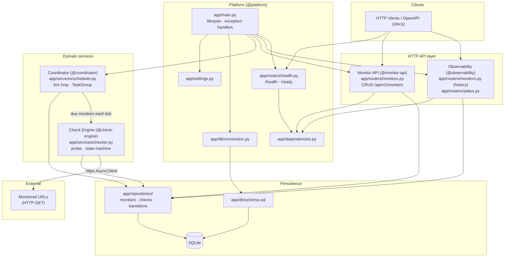
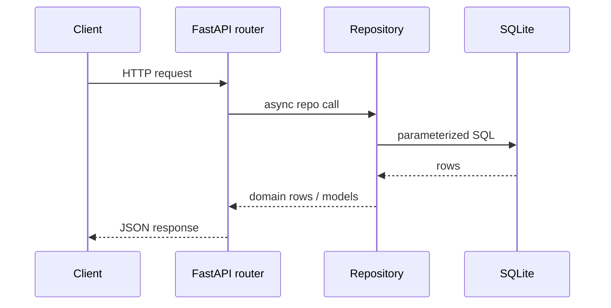
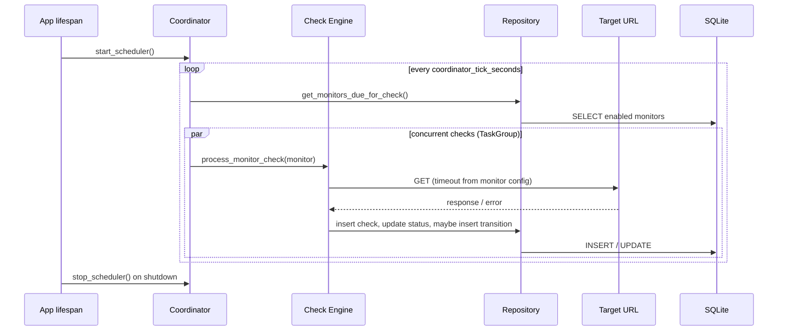
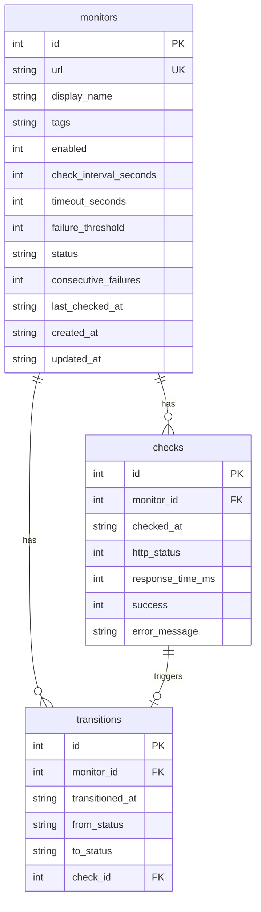

# URL Monitor API — Architecture

A long-running FastAPI service that persists monitor configuration in SQLite, probes URLs on a background schedule, and exposes a versioned REST API for configuration and observability.

## High-level diagram

## Runtime flows

### API request (configuration / queries)

Routes raise domain exceptions (`NotFoundError`, `ConflictError`); global handlers in `app/main.py` map them to structured JSON (`{"error", "message"}`).

### Background monitoring (no API trigger)

The API and scheduler share one `aiosqlite` connection opened at startup. Monitor creation does not trigger an immediate check — the coordinator picks up new monitors on the next eligible cycle.

## Vertical modules

The codebase is organized into five agent-scoped modules (see `.cursor/rules/`):

| Module | Responsibility | Key paths |
|--------|----------------|-----------|
| **Platform** | Bootstrap, settings, DB init, errors, health | `app/main.py`, `app/settings.py`, `app/db/`, `app/routers/health.py` |
| **Monitor API** | Monitor CRUD, validation, pagination | `app/routers/monitors.py` (CRUD), `app/repositories/monitors.py`, `app/schemas/monitors.py` |
| **Check Engine** | HTTP probe, UP/DOWN state machine | `app/services/checker.py`, `app/repositories/checks.py`, `app/repositories/transitions.py` |
| **Coordinator** | Background tick loop, due-monitor selection | `app/services/scheduler.py`, scheduler wiring in lifespan |
| **Observability** | History, transitions, status summary | `app/routers/status.py`, history routes on monitors router, `app/schemas/checks.py` |

## Data model

- **`monitors`** — configuration plus current runtime state (`status`, `consecutive_failures`, `last_checked_at`).
- **`checks`** — append-only log of every HTTP probe result.
- **`transitions`** — append-only log of status changes (`UNKNOWN` / `UP` / `DOWN`).

## State machine (Check Engine)

| Event | Current status | Result |
|-------|----------------|--------|
| Probe success | `UNKNOWN` or `DOWN` | → `UP`, record transition |
| Probe success | `UP` | stay `UP`, reset failure counter |
| Probe failure | any | increment `consecutive_failures` |
| Failures ≥ threshold | `UP` or `UNKNOWN` | → `DOWN`, record transition |

Default threshold: 3 consecutive failures. One success flips `DOWN` back to `UP`.

## Technology stack

| Layer | Choice |
|-------|--------|
| Web framework | FastAPI (async) |
| HTTP client | httpx.AsyncClient (shared in lifespan) |
| Database | SQLite via aiosqlite, raw SQL repositories |
| Config | pydantic-settings (`Settings` class, env / `.env`) |
| Concurrency | asyncio task loop + `TaskGroup` per coordinator cycle |
| Tests | pytest + httpx ASGITransport (no sync TestClient) |

## API surface (summary)

| Method | Path | Module |
|--------|------|--------|
| GET | `/health`, `/ready` | Platform |
| POST, GET, PATCH, DELETE | `/api/v1/monitors` … | Monitor API |
| GET | `/api/v1/monitors/{id}/checks` | Observability |
| GET | `/api/v1/monitors/{id}/transitions` | Observability |
| GET | `/api/v1/status/summary` | Observability |

Interactive OpenAPI docs: `/docs`.
