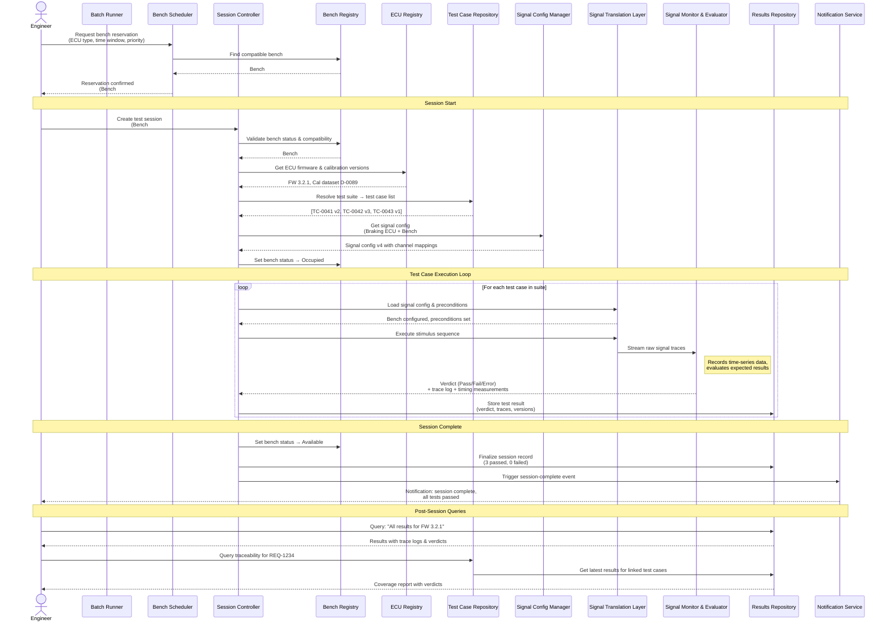

# ECU Test Bench Management System — Reference Solution

## Module Decomposition

**ECU Registry** — Manages the catalog of known ECU types, tracks individual ECU instances and their current firmware/calibration versions.

**Bench Registry** — Manages the inventory of physical test benches, their hardware channel capabilities, supported ECU types, and current operational status.

**Signal Configuration Manager** — Stores and versions the mapping definitions between ECU signal interfaces and bench hardware channels, including conversion formulas and timing parameters.

**Test Case Repository** — Handles creation, versioning, storage, and retrieval of test case definitions and their organization into test suites.

**Traceability Manager** — Maintains the bidirectional links between external requirement IDs and test cases, and provides coverage queries ("which requirements are verified, by what, with what result").

**Bench Scheduler** — Manages reservation requests, detects and resolves time conflicts, enforces priority rules, and designates automated regression windows.

**Session Controller** — Orchestrates the lifecycle of a single test session: validates inputs, sequences test case execution, delegates to the signal layer, collects results, and updates session status.

**Signal Translation Layer** — Translates abstract stimulus actions ("set speed to 60 km/h") into bench-specific hardware commands using signal configurations, and translates raw hardware readings back into named signal values.

**Signal Monitor & Evaluator** — Records time-series trace data from ECU outputs during execution and evaluates observed signals against expected results, applying tolerances and time windows to produce per-test-case verdicts.

**Results Repository** — Persistently stores all test results with full version context (firmware, calibration, signal config, test case version) and serves structured queries and comparisons.

**Notification Service** — Accepts event triggers from other modules (session complete, regression detected, bench available, conflict) and dispatches alerts through configured channels.

**Batch Runner / Simulation Engine** — Coordinates execution of multiple sessions across available benches, feeding the session controller and aggregating cross-session metrics like suite pass rates over time.

---

## Sequence Diagram — Test Session Execution Flow

